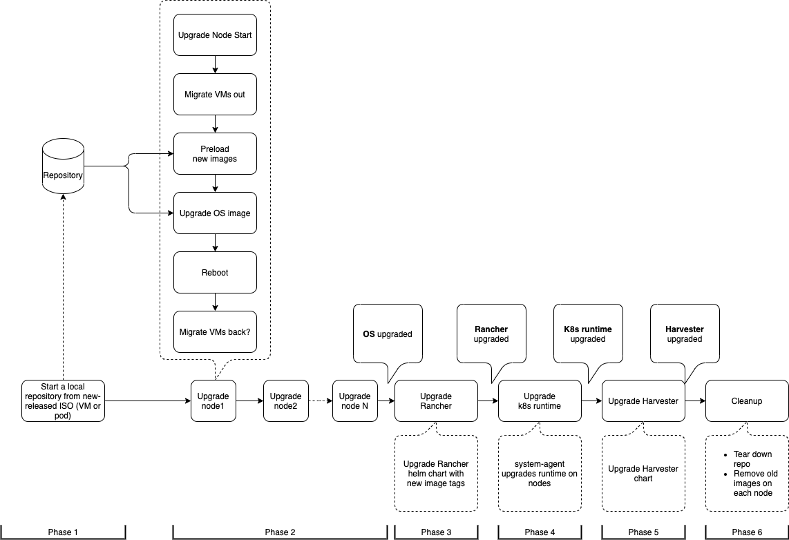

# Zero downtime upgrade

Issue: https://github.com/harvester/harvester/issues/1022

The manual upgrade process has similar flow: https://github.com/harvester/docs/pull/67/files

## Overview



## Phase 0. Preflight checks

We should reject an upgrade request if pre-flight checks doesn't pass.

- There are already an upgrade request
- There are non-ready/cordon/maintenance nodes
- There are running VMs contains degraded volumes and one of the volumes contains only one replica
- There are on-going VM backup/restore processes
- There are on-gong VM snapshot/restore snapshot

## Phase 1: Prepare a repo

- Host in the Harvester cluster:
    - Create a VirtualMachineImage from a Harvester release ISO file.
    - Run a VM with the image.
    - Run a webserver in the LiveOS to serve ISO content.
    - We might want to streamline this in upgrade controller.

- Or, Host the ISO content externally.


## Phase 2: Upgrade nodes

For each node:

- Live-migrate or shutdown VMs.
- Pre-load container images.
- Upgrade OS.
- Reboot.
- Live-migrate VMs back. (Or maybe not?).

## Phase 3: Upgrade Rancher server

- Get new rancher images tag from the repo.
- Upgrade rancher chart with newer image tags.

## Phase 4: Upgrade RKE2

- Edit version in cluster resource to upgrade RKE2. See some issues please see the **Obstacles** section.
    ```bash
    sudo -i kubectl edit clusters.provisioning.cattle.io local -n fleet-local
    ```


## Phase 5: Upgrade Harvester

- Upgrade Harvester chart from the repo.

## Phase 6: Cleanup

- Images used by previous releases can be deleted.


## Obstacles

## VMs with custom scheduling rules (nodeSelector) can't be live migrated

- Possible solutions
    - Do not add `evictionStrategy: LiveMigrate` to spec. (UI change).
    - Shutdown this kind of VMs before upgrading a node.

- Others
    - `nodeSelector`. `nodeSelector` can be updated in **VirtualMachine** resource, not in **VirtualMachineInstance.** VMs needs to be stop and start again to run on other node.

## Double drain operations

There are drain at these two points:

- After live migrating VMs to other nodes (phase 2).
- When rancher upgrade RKE2 on each nodes (phase 4).

There are two ways rancher upgrade RKE2:

- Upgrade RKE2 on nodes without draining nodes.
- Upgrade RKE2 on nodes with draining nodes. We need to use this one.
    - See an issue: https://github.com/rancher/rancher/issues/35310

Is there a way to do something before/after draining a node?

## VM live-migration issue
Draining a node cause kubevirt starts to live-migrate VMs on the node. But the drain fails with:

```bash
error: unable to drain node "node3", aborting command...

There are pending nodes to be drained:
 node3
error when evicting pods/"virt-launcher-test-vm-4-vndsz" -n "default": This pod has more than one PodDisruptionBudget, which the eviction subresource does not support.
error when evicting pods/"virt-launcher-test-vm-2-m78ww" -n "default": This pod has more than one PodDisruptionBudget, which the eviction subresource does not support.
```

VMs are migrated successfully, but the terminated `virt-launcher` pod causes the drain fails. If we drain the node again, the draining succeed.

To prevent this, we need to:
- taint the node first:
    ```
    kubectl taint node node3 kubevirt.io/drain=draining:NoSchedule
    ```
- Wait for VM migrated.
- Drain the node.
