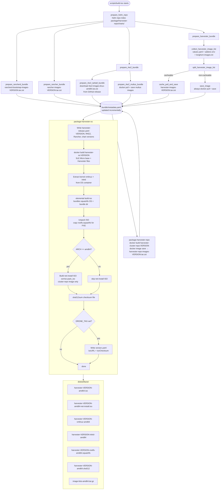

# Harvester ISO Build Pipeline

This document explains how `make build-iso` produces the Harvester ISO — every Make target involved, every Dockerfile stage, and how the image cache works.

---

## 1. Entry point: `make build-iso`

```makefile
build-iso: gen-version-env build-installer check-images
    $(DOCKER_BUILD) --target build-iso -t $(MK_ISO_BUILDER_IMAGE)
    $(ROOT)/scripts/mk-build-iso
```

Three Make prerequisites run first, then the target itself does two things:

1. **Docker build** `--target build-iso` — assembles a builder image (`MK_ISO_BUILDER_IMAGE`) that contains all compiled binaries, charts, and scripts needed to produce the ISO.
2. **`scripts/mk-build-iso`** — runs that image as a privileged container (with the Docker socket and the image-cache volume mounted), executes `scripts/build-iso` inside it, then copies the finished artifacts back to `dist/`.

### High-level flow

```
make build-iso
│
├─ gen-version-env          → scripts/version → writes .version_env
├─ build-installer          → Dockerfile: build-installer-output
│   └─ (depends on prepare-addons stage inside Docker)
├─ check-images             → Dockerfile: check-images
│
├─ docker build --target build-iso → $(MK_ISO_BUILDER_IMAGE)
│   BuildKit resolves COPY --from= deps automatically:
│   ├─ prepare-addons          (git clone + generate manifests/templates)
│   ├─ prepare-harvester-charts (helm package harvester + harvester-crd charts)
│   ├─ prepare-addons-charts   (helm pull monitoring/logging/pcidevices/… charts)
│   └─ build-installer         (compile harvester-installer binary)
│
└─ scripts/mk-build-iso
    └─ docker run (privileged, docker.sock + cache volume)
        └─ scripts/build-iso          ← main ISO assembly script
            ├─ prepare_helm_repo
            ├─ prepare_rancherd_bundle
            ├─ prepare_rancher_bundle
            ├─ prepare_rke2_bundle
            ├─ prepare_harvester_bundle
            ├─ scripts/package-harvester-repo
            └─ scripts/package-harvester-os  ← elemental build-iso
```

---

## 2. Make prerequisites

### `gen-version-env`

Runs `scripts/version` on the **host**. The script reads the git state and writes `scripts/.version_env`, exporting variables like `VERSION`, `COMMIT`, `CHART_VERSION`, `IMAGE_PUSH_TAG`, etc. This file is `COPY`'d into the Docker build context so the version is available inside the container even without a `.git` directory.

### `build-installer`

```makefile
build-installer: prepare-addons | $(ROOT)/bin
    $(DOCKER_BUILD) --target build-installer-output \
        --build-arg HARVESTER_ADDONS_VERSION=$(HARVESTER_ADDONS_VERSION) \
        --output type=local,dest=$(ROOT)
```

Runs `scripts/build-installer` inside the container, compiles the `harvester-installer` binary, and exports it to `bin/harvester-installer` on the host. The `build-installer` Dockerfile stage needs the addons repo (see §3).

`prepare-addons` target generates the addons template `rancherd-22-addons.yaml` that the installer [binary needs](https://github.com/harvester/harvester-installer/blob/934c6d1a004b1c8bdde020440a3d4fa3ca3dae32/pkg/config/cos.go#L741). The file eventually become `/etc/rancher/rancherd/config.yaml.d/22-addons.yaml` on a Harvester node.

### `check-images`

```makefile
check-images: prepare-addons gen-version-env
    $(DOCKER_BUILD) --target check-images
```

Runs `scripts/check-images` which validates that critical paired images (e.g. `rancher/rancher` ↔ `rancher/rancher-agent`, fleet ↔ fleet-agent) carry the same tag and that required images are present in the static image lists. Fails the build early before expensive operations begin.

Note this is simply a porting from https://github.com/harvester/harvester-installer/blob/master/scripts/check-images

---

## 3. Dockerfile stages

```
builder (golang:1.25.7-bookworm)
 │   apt: xorriso, mtools, squashfs-tools, docker-ce, zstd, …
 │   go install: yq, golangci-lint, controller-gen, ginkgo, openapi-gen, kind, codecov, helm
 │
 ├─ base ──────────── COPY . .
 │
 ├─ build ──────────── runs scripts/build → bin/harvester, bin/harvester-webhook
 │   └─ build-output (scratch)  → exported to host bin/
 │
 ├─ prepare-addons ── git clone harvester/addons
 │   └─ generates addons-manifests/ and addons-templates/
 │
 ├─ build-installer ─ COPY addons from prepare-addons
 │   │                runs scripts/build-installer → bin/harvester-installer
 │   └─ build-installer-output (scratch) → exported to host bin/
 │
 ├─ bundle-builder ── Base image for build-iso related target. Copy scripts/images/*.yaml scripts/lib/ into the base image.
 │
 ├─ prepare-addons-charts ─ pulls monitoring/logging/pcidevices/seeder/… helm charts
 │                           from upstream; patches & verifies them
 │
 ├─ prepare-harvester-charts ─ patches harvester and harvester-crd charts in `deploy/charts`; `helm package` → /dist/chart-tarballs/
 │
 ├─ check-images ──── runs scripts/check-images (validation only, no output)
 │
 └─ build-iso ──────── assembly stage (see §4)
```

### `prepare-addons` stage

Clones `github.com/harvester/addons` at the configured branch, then:
- Generates addon **manifests** → `/dist/prepare-addons/addons-manifests/`, These are AddOns manifests to be applied to a Harvester system. They are useful duing Harvester upgrade.
- Generates addon **templates** (rancherd config fragments like `rancherd-22-addons.yaml`) → `/dist/prepare-addons/addons-templates/`. files contain AddOns manifests to be applied by rancherd when system bootstraps.

These outputs are `COPY --from=prepare-addons` into multiple downstream stages.

### `bundle-builder` stage

A lightweight variant of `builder` with only `scripts/images/*.yaml` and `scripts/lib/` copied in. Serves as the base for `prepare-addons-charts`, `prepare-harvester-charts`, and `check-images` to avoid re-running the full apt/go install layer.

### `prepare-harvester-charts` stage

Runs `scripts/prepare-harvester-charts` (based on `bundle-builder`):

1. Sources `scripts/version` to get `VERSION` and `CHART_VERSION`.
2. Runs `scripts/patch-harvester` — applies any in-tree patches to `deploy/charts/harvester/`. This patch image and repo to developer's ones.
3. Packages `deploy/charts/harvester` and `deploy/charts/harvester-crd` into `.tgz` tarballs under `/dist/chart-tarballs/`. These are later be indexed by `helm repo index` in the `build-iso` stage and packaged into the `rancher/harvester-cluster-repo` image.

The `build-iso` stage consumes both outputs:
- `deploy/charts/` (the patched chart sources) — needed at runtime by `collect_harvester_image_list` to extract image repository/tag pairs from `values.yaml`.
- `/dist/chart-tarballs/*.tgz` — copied into `package/harvester-repo/charts/` to be served by the embedded Helm chart repository.

This stage has **no Make-level target**: it is triggered implicitly by BuildKit when `docker build --target build-iso` resolves the `COPY --from=prepare-harvester-charts` lines in the `build-iso` stage. And ideally not rebuilded if the chart sources haven't changed (BuildKit cache hit).

### `prepare-addons-charts` stage

Runs `scripts/prepare-addons-charts` (based on `bundle-builder`):

1. Reads addon version variables from `scripts/lib/addon` + the cloned addons repo (copied from `prepare-addons`).
2. `helm pull`s versioned chart tarballs from upstream Helm repositories for every addon: `rancher-monitoring`, `rancher-monitoring-crd`, `rancher-logging`, `rancher-logging-crd`, `harvester-vm-import-controller`, `harvester-pcidevices-controller`, `harvester-seeder`, `nvidia-driver-runtime`, `kubeovn-operator`, `kubeovn-operator-crd`, `descheduler`.
3. Applies patches to `rancher-monitoring` and `rancher-logging` charts.
4. Runs `helm repo index` over the output directory.
5. Validates that addon chart versions defined in the rancherd template files (e.g. `rancherd-22-addons.yaml`) match the versions of charts actually packed into the repo index.

The resulting `.tgz` files under `/dist/charts/` are copied into `package/harvester-repo/charts/` in the `build-iso` stage, alongside the harvester-chart tarballs.

Like `prepare-harvester-charts`, this stage has **no Make-level target** — BuildKit runs it automatically when resolving the `build-iso` stage's `COPY --from=prepare-addons-charts` line. Again, if the addon chart versions haven't changed, it should be a cache hit and not re-run.

### `build-iso` stage

The final assembly stage. It does **not** run the ISO build itself — it just collects everything into one image:

```dockerfile
FROM builder AS build-iso
WORKDIR /go/src/github.com/harvester/harvester

# compiled installer binary
COPY --from=build-installer .../bin/harvester-installer  package/harvester-os/files/usr/bin/

# addons repo (for image collection at runtime)
COPY --from=prepare-addons /dist/prepare-addons/addons/  /go/src/github.com/harvester/addons/

# patched harvester chart sources (for image tag extraction)
COPY --from=prepare-harvester-charts .../deploy/charts/  .../deploy/charts/

# harvester + harvester-crd chart tarballs
COPY --from=prepare-harvester-charts /dist/chart-tarballs/*  package/harvester-repo/charts/

# monitoring, logging, pcidevices, … chart tarballs
COPY --from=prepare-addons-charts /dist/charts/*.tgz  package/harvester-repo/charts/

# scripts and OS packaging sources
COPY scripts/             scripts/
COPY package/harvester-os/ package/harvester-os/
COPY package/harvester-repo/ package/harvester-repo/
```

The actual ISO assembly happens at **container run-time** via `scripts/mk-build-iso` → `scripts/build-iso`.

---

## 4. ISO assembly: `scripts/build-iso`

This script runs **inside** the privileged container spun up by `scripts/mk-build-iso`. It has access to the host Docker socket (for pulling/saving images) and the image-cache volume mounted at `/image-caches`.

### 4.0 ISO creation flowchart



### 4.1 Bundle directory structure

```
package/harvester-os/iso/bundle/
├── metadata.yaml                     ← image manifest (built incrementally)
├── harvester/
│   ├── images-lists/                 ← .txt files listing images per component
│   │   ├── rancher-images-<ver>.txt
│   │   ├── rke2-images.linux-amd64-<ver>.txt
│   │   ├── rke2-images-multus.linux-amd64-<ver>.txt
│   │   ├── harvester-images-<ver>.txt
│   │   ├── harvester-non-cacheable-images-<ver>.txt
│   │   └── harvester-repo-images-<ver>.txt
│   └── images/                       ← .tar.zst archives (docker-saved, zstd-compressed)
│       ├── rancher-images-<ver>.tar.zst
│       ├── rke2-images.linux-amd64-<ver>.tar.zst
│       ├── rke2-images-multus.linux-amd64-<ver>.tar.zst
│       ├── harvester-images-<ver>.tar.zst
│       └── harvester-repo-images-<ver>.tar.zst
└── rancherd/
    └── images/
        ├── rancherd-bootstrap-images-<ver>.txt
        └── rancherd-bootstrap-images-<ver>.tar.zst
```

Each bundle function calls `add_image_list_to_metadata` which appends an entry to `bundle/metadata.yaml` under one of three image type categories:

| Type | Purpose |
|------|---------|
| `common` | Rancher, Harvester, Longhorn, Kubevirt, and cluster-repo images |
| `rke2` | Kubernetes runtime (RKE2 core + Multus) |
| `agent` | Rancherd bootstrap images |

### 4.2 Bundle preparation functions

```
prepare_helm_repo          → helm repo index package/harvester-repo/charts/
prepare_rancherd_bundle    → rancherd-bootstrap-images → cache_pull_and_save("rancherd-bootstrap", …)
prepare_rancher_bundle     → rancher-images.txt → cache_pull_and_save("rancher", …)
prepare_rke2_bundle
  ├─ prepare_rke2_tarball_bundle  → download rke2-images.linux-amd64.tar.zst from GitHub release
  └─ prepare_rke2_multus_bundle   → save_image_list + cache_pull_and_save("multus", …)
prepare_harvester_bundle
  ├─ collect_harvester_image_list → merge values.yaml + addons env + longhorn images
  ├─ split_harvester_image_list   → cacheable vs non-cacheable split
  ├─ cache_pull_and_save("harvester-images", …)   ← cacheable subset
  └─ save_image("common", …)                      ← non-cacheable subset (always pulled)
```

Note, for `cache_pull_and_save` functions, refer to the section "7. Image cache management" below for the cache lookup flow and validation logic.

### 4.3 Harvester image list assembly

`collect_harvester_image_list` builds a unified image list from four sources:

```
deploy/charts/harvester/values.yaml   (repository + tag pairs from chart)
       +
addons env vars                        (VM_IMPORT_CONTROLLER_IMAGE, PCIDEVICES_CONTROLLER_IMAGE, …)
       +
scripts/images/harvester-additional-images.txt
       +
longhorn-images.txt                    (fetched from upstream Longhorn GitHub release)
```

After merging, it normalises registry prefixes (adds `docker.io/` prefix where missing), fills in missing `:latest` tags, deduplicates, and removes images not needed on Harvester (openshift-oauth-proxy, local-path-provisioner, traefik, klipper-lb, multus).

`split_harvester_image_list` then routes each image to either the cacheable or non-cacheable list:

**Cacheable** images are images that are safe to pull once, save as a tarball in the cache, and re-use across multiple builds until the image list changes. For examples, the following images are cacheable because they usually have stable versioned tags and don't change frequently:

```
docker.io/kubeovn/kube-ovn:v1.16.1
docker.io/longhornio/backing-image-manager:v1.12.0
docker.io/longhornio/csi-attacher:v4.12.0
docker.io/longhornio/csi-node-driver-registrar:v2.17.0
docker.io/longhornio/csi-provisioner:v5.3.0-20260514
docker.io/longhornio/csi-resizer:v2.1.0-20260514
docker.io/longhornio/csi-snapshotter:v8.5.0-20260514
docker.io/longhornio/livenessprobe:v2.19.0
docker.io/longhornio/longhorn-cli:v1.12.0
docker.io/longhornio/longhorn-engine:v1.12.0
docker.io/longhornio/longhorn-instance-manager:v1.12.0
docker.io/longhornio/longhorn-manager:v1.12.0
docker.io/longhornio/longhorn-share-manager:v1.12.0
docker.io/longhornio/longhorn-ui:v1.12.0
docker.io/longhornio/support-bundle-kit:v0.0.86
docker.io/rancher/harvester-kubeovn-operator:v1.16.1-dev.0
docker.io/rancher/kuberlr-kubectl:v7.0.3
docker.io/rancher/mirrored-kube-vip-kube-vip-iptables:v1.0.4
ghcr.io/k8snetworkplumbingwg/whereabouts:v0.9.3
registry.k8s.io/descheduler/descheduler:v0.33.0
registry.k8s.io/sig-storage/snapshot-controller:v8.5.0
registry.suse.com/bci/bci-base:16.0
registry.suse.com/suse/sles/15.7/cdi-apiserver:1.62.0-150700.9.3.1
registry.suse.com/suse/sles/15.7/cdi-cloner:1.62.0-150700.9.3.1
registry.suse.com/suse/sles/15.7/cdi-controller:1.62.0-150700.9.3.1
registry.suse.com/suse/sles/15.7/cdi-importer:1.62.0-150700.9.3.1
registry.suse.com/suse/sles/15.7/cdi-operator:1.62.0-150700.9.3.1
registry.suse.com/suse/sles/15.7/cdi-uploadproxy:1.62.0-150700.9.3.1
registry.suse.com/suse/sles/15.7/cdi-uploadserver:1.62.0-150700.9.3.1
registry.suse.com/suse/sles/15.7/libguestfs-tools:1.7.0-150700.3.21.1
registry.suse.com/suse/sles/15.7/virt-api:1.7.0-150700.3.21.1
registry.suse.com/suse/sles/15.7/virt-controller:1.7.0-150700.3.21.1
registry.suse.com/suse/sles/15.7/virt-handler:1.7.0-150700.3.21.1
registry.suse.com/suse/sles/15.7/virt-launcher:1.7.0-150700.3.21.1
registry.suse.com/suse/sles/15.7/virt-operator:1.7.0-150700.3.21.1
registry.suse.com/suse/vmdp/vmdp:2.5.5
```

**Non-cacheable** images must be freshly pulled on every build and cannot be stored in the cache (e.g. because they have volatile tags like `master` or are built in this CI run and not present at the start of the build):

```
192.168.2.133:5000/bk201z/harvester-upgrade:wip-buildx-installer-head
192.168.2.133:5000/bk201z/harvester-webhook:wip-buildx-installer-head
192.168.2.133:5000/bk201z/harvester:wip-buildx-installer-head
docker.io/rancher/harvester-eventrouter:master-head
docker.io/rancher/harvester-load-balancer-webhook:master-head
docker.io/rancher/harvester-load-balancer:master-head
docker.io/rancher/harvester-network-controller:master-head
docker.io/rancher/harvester-network-helper:master-head
docker.io/rancher/harvester-network-webhook:master-head
docker.io/rancher/harvester-networkfs-manager:main-head
docker.io/rancher/harvester-node-disk-manager-webhook:master-head
docker.io/rancher/harvester-node-disk-manager:master-head
docker.io/rancher/harvester-node-manager-webhook:master-head
docker.io/rancher/harvester-node-manager:master-head
docker.io/rancher/harvester-pcidevices:master-head
docker.io/rancher/harvester-seeder:main-head
docker.io/rancher/harvester-vm-import-controller:main-head
docker.io/rancher/support-bundle-kit:master-head
```

Basically branch-head images are considered non-cacheable.

### 4.4 `package-harvester-repo`

Builds the `rancher/harvester-cluster-repo:$VERSION` Docker image from `package/harvester-repo/` (which contains all the chart tarballs), saves it as `harvester-repo-images-$VERSION.tar.zst`, and adds it to `metadata.yaml`. This image is what nodes use at runtime to access the embedded Helm chart repository.

### 4.5 `package-harvester-os`

The final ISO packaging step:

```
1. Load version vars (scripts/version, version-rke2, version-rancher)
2. Write harvester-release.yaml  (version manifest embedded in the OS)
3. Archive historical image lists for upgrade paths
4. docker build → rancher/harvester-os:$VERSION  (SLE Micro base OS image)
5. Extract kernel (vmlinuz / Image) and initrd from the OS container
6. elemental build-iso  → dist/artifacts/<prefix>-amd64.iso
7. Unpack ISO, copy rootfs.squashfs for PXE
8. [amd64 only] Build net-install ISO  (pack_iso via xorriso)
9. sha512sum checksum file
10. [DRONE_TAG only] Write version.yaml with ISO URL and checksum
```

The `elemental build-iso` command takes the assembled `package/harvester-os/iso/` tree (with the bundle directory inside it) and the harvester-os Docker image as inputs, and produces a bootable hybrid ISO.

### 4.6 Net-install ISO

For `amd64` builds, a second smaller ISO is produced that does not embed the full image bundle. It retains only the `harvester-cluster-repo` image (enough to bootstrap the cluster), and sets `harvester.install.with_net_images=true` in the GRUB config so the installer fetches remaining images over the network during installation.

```
Full ISO  → all image bundles embedded
Net ISO   → cluster-repo image only, net fetch for the rest
```

You can specify `DISABLE_BUILD_NET_INSTALL_ISO` environment variable to skip building the net-install ISO.

---

## 5. `scripts/mk-build-iso`: host ↔ container bridge

```bash
docker run --privileged
    -v /var/run/docker.sock:/var/run/docker.sock    # host Docker access for image pulls/saves
    -v "${MK_IMAGE_CACHE_VOLUME}:/image-caches"    # persistent image cache
    --env MK_REPO_ID ...
    ${MK_ISO_BUILDER_IMAGE}
    ./scripts/build-iso

# After the container exits:
docker cp <container>:.../dist/artifacts/. dist/artifacts/
docker cp <container>:.../dist/harvester-cluster-repo  dist/
```

The privileged flag is required because `elemental build-iso` mounts loop devices internally. The Docker socket mount allows `docker pull` and `docker image save` to operate against the host daemon.

---

## 6. Artifacts produced

| File | Description |
|------|-------------|
| `dist/artifacts/<prefix>-amd64.iso` | Full bootable ISO |
| `dist/artifacts/<prefix>-amd64-net-install.iso` | Network-install ISO (amd64 only) |
| `dist/artifacts/<prefix>-vmlinuz-amd64` | Kernel for PXE boot |
| `dist/artifacts/<prefix>-initrd-amd64` | Initrd for PXE boot |
| `dist/artifacts/<prefix>-rootfs-amd64.squashfs` | Root filesystem for PXE |
| `dist/artifacts/<prefix>-amd64.sha512` | SHA-512 checksums |
| `dist/artifacts/image-lists-amd64.tar.gz` | All image list `.txt` files |
| `dist/artifacts/harvester-images-list-amd64.txt` | Combined image list |
| `dist/harvester-cluster-repo/` | Helm chart repository (for CI publishing) |

---

## 7. Image cache management

The image cache avoids re-pulling hundreds of container images on every ISO build. It is implemented in `scripts/lib/cache` and uses a **named Docker volume** as backing store.

The images are pulled to local docker daemon with `docker pull` and saved as compressed tarballs with `docker image save + zstd`. The cache is keyed by the SHA256 of the image list file, so any change to the list (new image, version bump) produces a different key and a cache miss.

> [!NOTE]
> An alternative approach is to use the BuildKit cache directly: feed an `image-list.txt` as the input to a Dockerfile stage and use `skopeo` for daemonless pulls inside that stage. If the list is unchanged, the BuildKit cache is hit and the stage is skipped entirely. This was prototyped but ultimately dropped for three reasons:
> * **Cache is not controllable.** BuildKit only exposes `buildx prune` for cache eviction, which is coarse-grained. The Docker volume approach allows keeping exactly N tarballs per component and pruning the oldest deterministically.
> * **Storage overhead.** `COPY --from=<stage>` always materialises a new image layer, so the tarball occupies space both in the BuildKit cache and in the image layer store. This doubles disk usage and can silently trigger an automatic `buildx prune`, evicting other useful cache entries.
> * **skopeo cannot produce a Docker-save tarball.** `skopeo copy` with an OCI layout destination does work for multiple images, but the resulting blobs are already individually compressed. Re-compressing the whole archive with zstd yields almost no size reduction, and loading an OCI-layout tarball during Harvester upgrade would require additional decompression steps compared to a standard `docker load`-compatible archive.

### 7.1 Volume identity

```makefile
MK_IMAGE_CACHE_VOLUME ?= harvester-image-cache-$(MK_REPO_ID)
```

`MK_REPO_ID` is a SHA256 prefix derived from the absolute repo path + machine-id, so each repo checkout on a machine gets its own cache volume by default. Set `MK_IMAGE_CACHE_VOLUME` to a fixed name to share cache across checkouts (no locking — only safe for sequential builds).

### 7.2 Cache layout

```
/image-caches/                         ← volume root (IMAGE_CACHE_ROOT)
├── <component>/
│   └── <16-char-sha256-key>/
│       ├── images.txt                 ← the exact image list this entry was built from
│       ├── images.tar.zst             ← docker-saved + zstd-compressed tarball
│       └── images.tar.zst.sha256     ← sha256 of the tarball (integrity check)
└── rke2/
    └── <rke2-version>/               ← special: downloaded tarball, not docker-saved
        ├── images.txt
        └── images.tar.zst
```

The cache key for docker-saved entries is the SHA256 of the **image list file**:

```bash
cache_hash() { sha256sum "$1" | cut -c1-16; }
```

Any change to the image list (new image, version bump) produces a different key and a cache miss.

The `rke2` sub-directory is **reserved** and handled differently: RKE2 core images come as a pre-built tarball from GitHub releases, so caching is a simple file copy rather than a docker pull + save.

### 7.3 Cache lookup flow

```
cache_pull_and_save(component, key, list_file, output_archive)
│
├─ MK_IMAGE_CACHE_BYPASS set?
│   YES → docker pull + save directly (skip cache entirely)
│
├─ component == "rke2"?
│   YES → ERROR (use prepare_rke2_tarball_bundle instead)
│
└─ _cache_valid(cache_dir, list_file)?
    │
    ├─ YES (HIT) → cp cache_dir/images.tar.zst  output_archive
    │
    └─ NO  (MISS)
        ├─ docker_pull_and_save(list_file, output_archive)
        ├─ cp output_archive  → cache_dir/images.tar.zst
        ├─ cp list_file       → cache_dir/images.txt
        ├─ sha256sum          → cache_dir/images.tar.zst.sha256
        └─ cache_prune(component)
```

### 7.4 Cache validation (`_cache_valid`)

A cache entry is considered **valid** only when all three conditions hold:

1. All three files exist (`images.tar.zst`, `images.tar.zst.sha256`, `images.txt`)
2. `images.txt` matches the current list file byte-for-byte (`diff -q`)
3. `MK_IMAGE_CACHE_VERIFY=1` (default): stored SHA256 matches the actual tarball checksum

A checksum mismatch prints a warning and treats the entry as a miss (the corrupted tarball is not deleted automatically; run `make image-cache-clean` to reset).

### 7.5 Cache pruning

After a store, `cache_prune(component)` enforces the per-component limit:

```
while count(entries) > MK_IMAGE_CACHE_MAX_ITEMS (default: 5):
    rm -rf oldest-entry  (by mtime, ls -dt | tail -1)
```

This bounds disk usage to approximately `5 × <tarball size>` per component.

### 7.6 Non-cacheable images

Some images must **always** be pulled fresh and cannot be stored in the volume cache:

| Condition | Reason |
|-----------|--------|
| Tag is `master`, `master-head`, `main`, `main-head`, `dev`, `dev-head` | Volatile/mutable tags; cached content would be stale |
| Tag in `scripts/images/cache.yaml` → `exclude.tags` | Project-specific exclusion list |
| Repo in `scripts/images/cache.yaml` → `exclude.repos` | Project-specific exclusion list |
| `is_push_repo_image` (same repo, same `IMAGE_PUSH_TAG`) | Images built in **this** CI run; must be fresh |

These images are routed to the `non_cacheable_list` by `split_harvester_image_list` and saved via `save_image` (which calls `pull_images` + `docker image save` directly, bypassing `cache_pull_and_save`).

### 7.7 Cache management targets

| Target | Action |
|--------|--------|
| `make image-cache-show` | List all cached entries (read-only, alpine container) |
| `make image-cache-debug` | Interactive shell inside the cache volume for manual inspection |
| `make image-cache-clean` | Delete the entire cache volume (`docker volume rm`) |

### 7.8 Environment variable reference

| Variable | Default | Effect |
|----------|---------|--------|
| `MK_IMAGE_CACHE_VOLUME` | `harvester-image-cache-<repo-id>` | Named Docker volume used as cache backing store |
| `MK_IMAGE_CACHE_BYPASS` | _(empty)_ | Non-empty: skip cache entirely; always pull fresh |
| `MK_IMAGE_CACHE_MAX_ITEMS` | `5` | Max entries per cache component before oldest is pruned |
| `MK_IMAGE_CACHE_VERIFY` | `1` | `1`: verify sha256 before serving from cache; `0`: skip check |
| `USE_LOCAL_IMAGES` | _(empty)_ | If set to a tag, skip pull for images with that tag if already present locally |

### 7.9 Cache lifecycle diagram

```
Build N (cold)                Build N+1 (warm)              Build N+2 (image bump)
─────────────────────         ─────────────────────         ─────────────────────
hash(list) = "aabb1234"       hash(list) = "aabb1234"       hash(list) = "ccdd5678"
    │                              │                              │
    ▼                              ▼                              ▼
MISS                           HIT                           MISS
 │                              │                              │
 ├─ docker pull all images      ├─ cp cache → output           ├─ docker pull all images
 ├─ docker image save           └─ (done, fast)                ├─ docker image save
 ├─ write to cache                                             ├─ write to cache (new key)
 └─ prune if > max_items                                       └─ prune oldest if > max_items
                                                                  (may evict "aabb1234")
```

---

## 8. Component dependency diagram

```
                         make build-iso
                              │
         ┌────────────────────┼──────────────────────┐
         ▼                    ▼                      ▼
  gen-version-env      build-installer          check-images
  (scripts/version)    (Docker target)          (Docker target)
                             │
                    ┌────────┴───────┐
                    ▼               ▼
            prepare-addons    build-installer
            (Docker stage)    (Docker stage)
                    │               │
                    │         scripts/build-installer
                    │         → bin/harvester-installer
                    │
            git clone addons
            generate manifests/templates
                              │
          ┌───────────────────┼──────────────────────┐
          ▼                   ▼                      ▼
  prepare-harvester-charts  prepare-addons-charts  bundle-builder
  (helm package harvester,  (helm pull monitoring, (base for chart stages)
   harvester-crd)            logging, pcidevices, …)
          │                   │
          └─────────┬─────────┘
                    ▼
              build-iso image (MK_ISO_BUILDER_IMAGE)
                    │
                    ▼
           scripts/mk-build-iso
           docker run --privileged
                    │
                    ▼
           scripts/build-iso (inside container)
           ├─ prepare_helm_repo
           ├─ prepare_rancherd_bundle   ──► cache: rancherd-bootstrap/<key>/
           ├─ prepare_rancher_bundle    ──► cache: rancher/<key>/
           ├─ prepare_rke2_bundle
           │   ├─ tarball download      ──► cache: rke2/<version>/
           │   └─ multus pull+save      ──► cache: multus/<key>/
           ├─ prepare_harvester_bundle  ──► cache: harvester-images/<key>/
           ├─ scripts/package-harvester-repo
           └─ scripts/package-harvester-os
               └─ elemental build-iso
                   └─ dist/artifacts/*.iso
```
